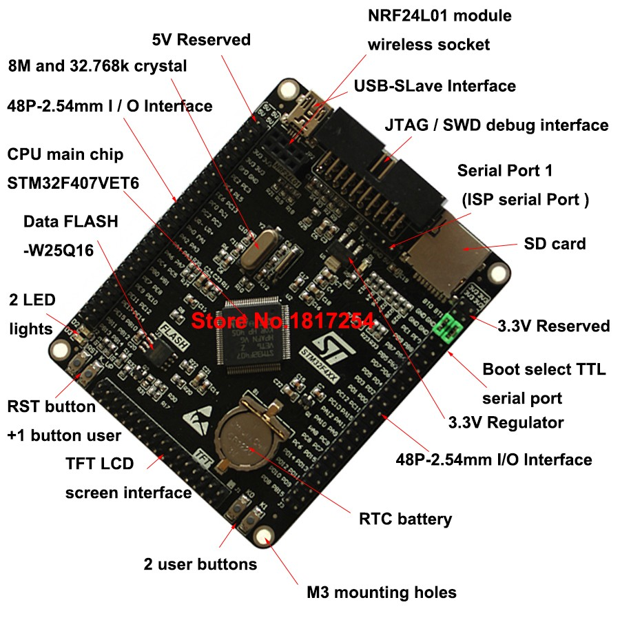

# Porting Chibios for Black STM32F4VET6
The boards based on the `STM32F4VET6` are becoming famous because of their low cost and it is also easy to port, since there is much support for STM32F4 in chibios. 

The board files have been generated using the `OLIMEX E407` boards because of their similarities. 

It does have lot on I/O



and there are lots of resources collected when porting Chibios to this board which can be found in `Resources` folder.

## Example
This is a small example to verify whether the Porting worked or not. It just blinks two on board LEDs.

```c
palToggleLine(LINE_LED_D2);
palToggleLine(LINE_LED_D3);
```

## Programming the board
The board can be programmed using the SWD interface 

| Pin function | Pin number | Alternate Function  |
|--------------|------------|---------------------|
|     SWDIO    |    Pin 7   | PA13/TMS/JTMS_SWDIO |
|      GND     |    Pin 4   |                     |
|     SWCLK    |    Pin 9   | PA14/TCK/JTMS_SWCLK |
|     3.3V     |    Pin 1   |                     |

```
  +-----+
  | 1  2|  Pin 1 = 3v3
  | 3  4|  Pin 4 = GND
  | 5  6|
 _| 7  8|  Pin 7 = SWDIO
|   9 10|  Pin 9 = SWCLK
|_ 11 12|
  |13 14|
  |15 16|
  |17 18|
  |19 20|
  +-----+
```

All the pinouts can be found in `Resources` folder.
