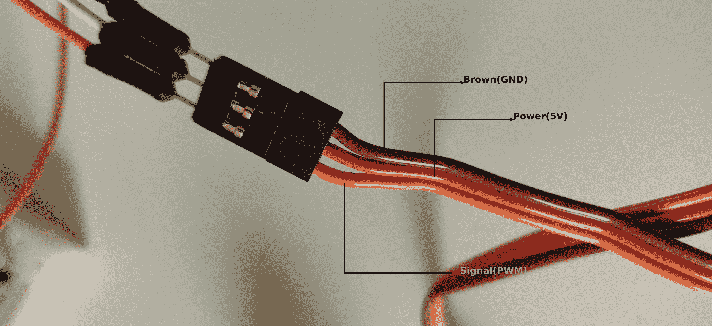

## Servo control

Controlling servo using the PWM output of Chibios. The servo motor that I had was [Corona DS319HV](https://hobbyking.com/en_us/corona-ds-319hv-digital-metal-gear-servo-4-2kg-0-05s-34g.html) and can be controlled by supplying PWM signal with frequency of 50HZ and the rotation can be changed by varying the pulse width from 1ms to 2ms.

Normally servos will have 3 wires(Power, Ground and the Signal) and different manufacturers color each wire differently. In the case of servo that I had 

| Color  | Function    |
| ------ | ----------- |
| Brown  | Ground      |
| Red    | Power(5V)   |
| Orange | Signal(PWM) |




> It should be noted that the GND of the Servo and GND of STM32F4 should be coupled or else you will get jitters and the Servo will go crazy.

#### Controlling the servo using the PS4 controller

ROS has been used to relay values from PS4 controller to STM32F4 discovery board. The driver that has been used is [ds4_driver](https://github.com/naoki-mizuno/ds4_driver) and the neat thing about this driver is that it will publish `Joy` messages on `joy` topic that can be forwarded to `rosnode` running on STM32F4 subscribed to `joy` topic. 

The installation instructions for `ds4_driver` can be found in the repository linked above. After building the driver can be launched using 

```bash
roslaunch ds4_driver ds4_driver.launch
```

You will need to start rosserial to forward the messages to the microcontroller. rosserial can be launched

using 

```bash
rosrun rosserial_python serial_node.py _port:=/dev/ttyACM1
```

