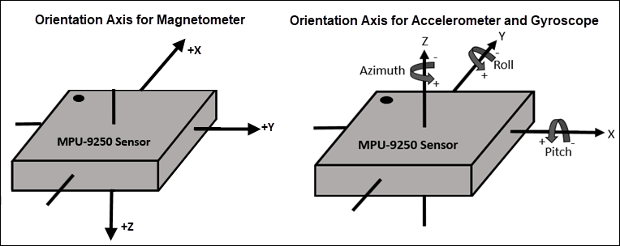

## MPU9250 C++ 

A Small example that illustrates how chibios can be used in C++ environment. 

Please take a look at SPIExample for the explanation of SPI driver in Chibios.

#### Note
> Don't for get to modify `MakeFile` to include cpp part of Chibios.

```
include $(CHIBIOS)/os/various/cpp_wrappers/chcpp.mk
```
This line includes the cpp part of chibios.

The written `MPU9250` class takes `SPIDriver` and `SPIConfig` as arguments and sets them as internal private variables. 

The `probeMPU9250` is a small function that checks whether we can communicate with the device.

In the present state, the accelerometer and gyroscope data are sent over serial. The data on the serial port
can be read and plotted using the python script in `Scripts` folder.

#### Video of script working


#### Coordinate frames of MPU9250
