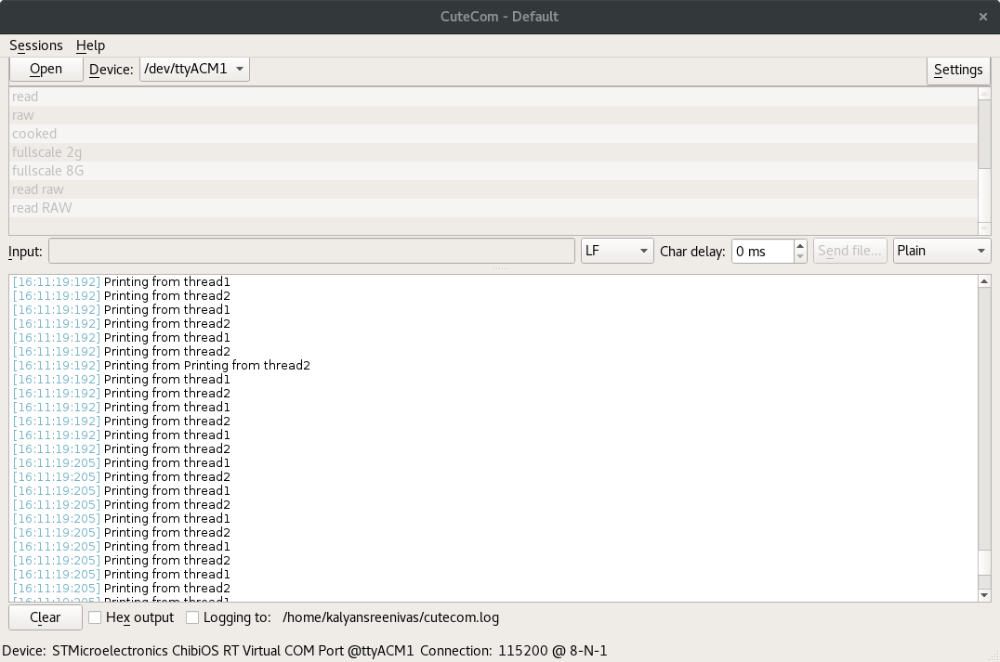

# Using Mutexes in Chibios

When ever two or more threads are trying to utilize same resource, then there exists a race condition between them. They race each other to get the resource. The problem with that is that the output that we get is dependent up on the thread which first wins the race. 

For example, if we are trying to fill up an array from 2 different threads, then the elements in the array will be partially or more filled up by one thread and the remaining by another thread. This is not the behavior we want. 

In this example, instead of filling up an array using two threads, we will be printing some information to the terminal. If the threads try to print to the terminal at the same time, then somepart of the sentence will be filled up by one thread and the remaining will be printed by another thread and all you see is mispelled garbage.



In the above figure, you can easily see that the two threads are trying to take over the `BaseSequentialStream` object in Chibios.

To avoid this, we use Mutexes. 

In chibios, the mutex has to be first defined,

```c
static mutex_t mtx;
```
then, like every driver, it has to be initialized,

```c
// Initialize mutex
  chMtxObjectInit(&mtx);
```

and then the resource can be locked using 

```c
chMtxLock(&mtx);
chprintf(chp, "Printing from thread1\n");
chMtxUnlock(&mtx);
```