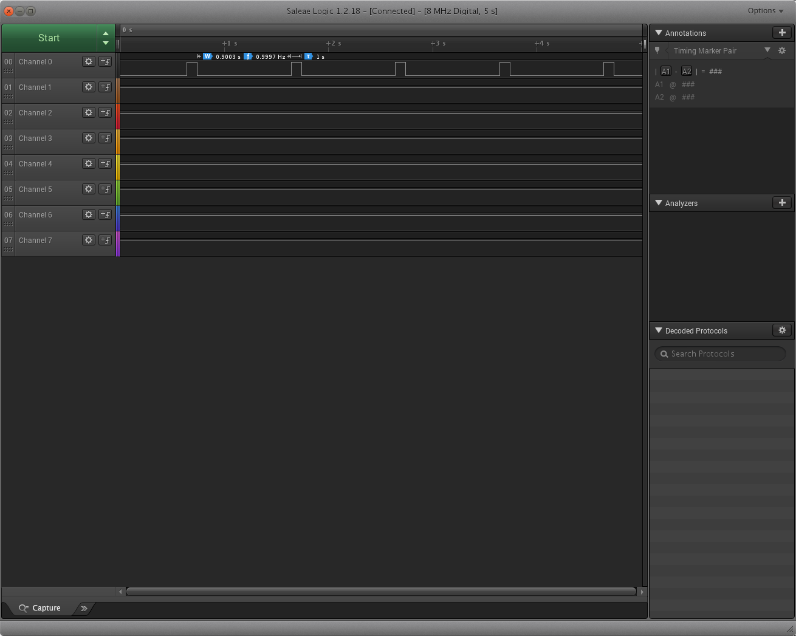

# Interrupt based PWM frequency change

This small example elucidates the procedure to enable interrupts on the GPIO pin and the callback functions that are required to be set and finally, it also shows how the events can be dispatched when a certain interesting interrupt is generated(in our case the rising edge when the button has been pressed).

## Requirements
1. We need to enable event handling on the GPIO( here User button) that we are interested in.
2. The PWM output has to be routed to the on-board LED(LD4).
3. Event has to be generated when the button is pressed. For this we need to enable callbacks.

## Coding
### Registering and Initializing events
In ChibiOS, to enable `events` they have to be defined first. The events can be defined by using the `event_source_t` type.

```C
static event_source_t buttonPressedEvent;
```
In the above code snippet an event called `buttonPressedEvent` has been defined.

After the required events were defined, we need to initialize the events using `chEvtObjectInit` which tells chibiOS about the events defined.
```C
chEvtObjectInit(&buttonPressedEvent);
```
As you can see, the above defined event has been initialized.
After required events have been initialized, its time to register them. They can be registered using `chEvtRegister` function. This function needs the event that has been registered, an event listener which can be defined using `event_listener_t eventListenerButton;` and the number of the event which we will use later when we are masking events.
```C
/* Register events */
chEvtRegister(&buttonPressedEvent, &eventListenerButton, 0);
```
### Enabling event handling for GPIO
The event handling concerning to the GPIO that we are interested in has to be enabled in order to call callbacks. 
The event handling on GPIO can be enabled using 
```C
palEnablePadEvent(GPIOA, GPIOA_BUTTON, PAL_EVENT_MODE_RISING_EDGE);
```
In the above code snippet, we are using user button which already comes with STM32F4Discovery board.
After enabling the event handling we need to set callback. The callback is the function which will be called when the registered event happens(in our case `RISING_EDGE` that corresponds to the button being pressed).

```C
palSetPadCallback(GPIOA, GPIOA_BUTTON, &buttonCallBack, NULL);
```
In the above code snippet the button and the function `&buttonCallBack` has been set as a callback.

###Note 
1) It has been observed that we cannot use normal `pwmEnableChannel` to change the on time of the channel in callback. We need to lock it from ISR using `chSysLockFromISR` and change it using `pwmEnableChannelI`.

## Understanding chibiOS PWM
It can be said that the `PWMConfig` in chibiOS is confusing. In this section, I will try to clear some of the confusions regarding PWM. 
```C
static PWMConfig pwmCFG = {
		10000,					/* Clock frequncy */
		10000,					/* Period of the PWM driver */
		NULL,					/* No callback */
								/* Switchon channels */
		{
				{PWM_OUTPUT_ACTIVE_HIGH, NULL},
				{PWM_OUTPUT_DISABLED, NULL},
				{PWM_OUTPUT_DISABLED, NULL},
				{PWM_OUTPUT_DISABLED, NULL}
		},
		0,
		0
};
```
In the above code snippet, the first argument in `PWMConfig` is the clock frequency of the PWM channel. Set to as high as possible normally in MHz range. 

The second argument is the period of the PWM channel. This is confusing, let's clear it up by taking an example.

Lets assume that we have set the Clock frequency of the PWM channel to be 10kHz. If we set the Period of the PWM driver(second argument in Config) to 10kHz as well, then we get the period of PWM channel as 1 second i.e. if we route the PWM channel to an LED then the led gets toggled every one second. 

```math
frequency = 10kHz / 10kHz
frequency = Firstargument / Secondargument
```
The specific channel can be enabled using `pwmEnableChannel(pwmDriver, channel, on_time)`. On time is the time that the LED stays on during the PWM swtiching. The `on_time` can be calculated using 
```C
pwmEnableChannel(&PWMD4, 0, 5000[lets say pwmEnTime]);
```
The on_time of an LED can be calculated using 
```math
on_time = pwmEnTime / period(second argument in Config)
```
So the LED stays on 50% of the time, which is 50% duty cycle.
###Example

In the above figure as you can see that the on_time of LED is 1% of the time. If the LED is toggling at 1hz then LED will stay on only 10% of the time i.e. 0.1 seconds.
